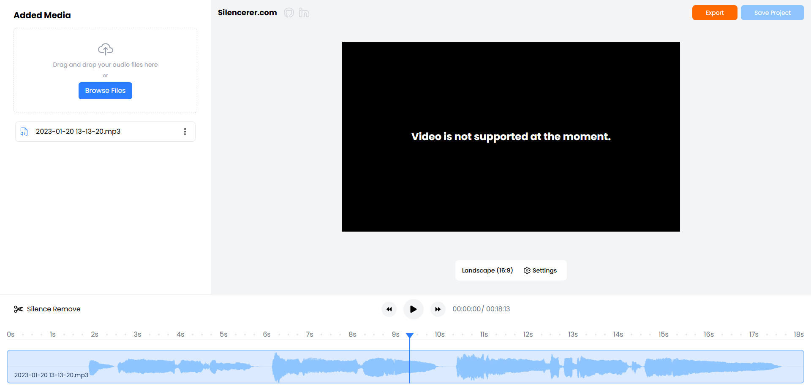

# Silencerer - Free Silence Detection & Removal

Online free audio silence detection & removal software.

## Screenshots



## Prerequisites

Before you start, make sure you have the following installed:

- [Node.js](https://nodejs.org/en) (v20 or newer)

## Getting Started

### 1. Clone the repository

```
git clone https://github.com/marionikolov17/silencerer.git
cd silencerer
```

### 2. Install dependecies

```
npm install
```

### 3. Start the development server

```
npm run dev
```

## Development

- `npm run dev` - Starts the development server
- `npm run prettier` - Run prettier
- `npm run lint` - Run linter

## Tech Stack

- [Next.js](https://nextjs.org/) (v15)

## Releases

- 0.0.1 (Initial deployment - 6th June, 2025)

## Contributing

1. Fork the repository
2. Create your feature branch - `git checkout -b [your name]/feature/[feature name]`
3. Commit your changes to your branch
4. Push to origin
5. Open a pull request

## License

This project is licensed under Apache-2.0 license - see LICENSE file.
